# Software & System Architecture: A Comprehensive Technical Explainer

A practical guide to architectural styles, principles, scaling strategies, and real-world decision-making — written to be useful for beginners and detailed enough for intermediate/advanced practitioners.

---

## Table of Contents

1. [Introduction to Software Architecture](#1-introduction-to-software-architecture)
2. [Types of Software Architecture](#2-types-of-software-architecture)
3. [Importance of Good Architecture](#3-importance-of-good-architecture)
4. [Key Architectural Principles](#4-key-architectural-principles)
5. [How to Maintain Architecture](#5-how-to-maintain-architecture)
6. [How to Scale Architecture](#6-how-to-scale-architecture)
7. [Tools & Frameworks](#7-tools--frameworks)
8. [Case Study: E-Commerce App, Monolith → Microservices](#8-case-study-e-commerce-app-monolith--microservices)
9. [Common Pitfalls](#9-common-pitfalls)

---

## 1. Introduction to Software Architecture

### 1.1 What Is Software Architecture, and Why It Matters

Software architecture is the set of high-level structural decisions about a system: how it's divided into components, how those components communicate, where state lives, and what quality attributes (scalability, security, availability) the structure is optimized for. It's the decisions that are **expensive to change later** — as opposed to implementation details that are cheap to change.

A useful test: if reversing a decision requires rewriting a large portion of the system rather than editing a function, it's an architectural decision (e.g., "we use a relational database" vs. "we use PostgreSQL specifically").

It matters because architecture sets the **ceiling** on what a system can do well. A well-chosen architecture makes performance, scaling, and adding features straightforward; a poorly-chosen one means every feature costs more than it should, and some capabilities (e.g., scaling to 10x traffic) may become nearly impossible without a rewrite.

### 1.2 Architecture vs. Design

| | Architecture | Design |
|---|---|---|
| **Scope** | System-wide structure | Component/module-internal structure |
| **Examples** | Monolith vs. microservices, sync vs. async communication, database-per-service | Class hierarchies, function signatures, a specific algorithm |
| **Cost to change** | High — often requires cross-team coordination | Low-to-moderate — usually contained to one codebase/module |
| **Typical horizon** | Years | Weeks to months |

In short: **architecture is the shape of the forest; design is the shape of each tree.** Both matter, but mistakes in architecture are far more expensive to correct.

### 1.3 Role of an Architect vs. a Developer

| | Software Architect | Developer |
|---|---|---|
| **Primary focus** | Cross-cutting structure, trade-offs, non-functional requirements (NFRs) | Implementing features within the established structure |
| **Typical decisions** | Choice of architecture style, tech stack, data ownership boundaries, integration patterns | Class design, function logic, local optimizations, unit tests |
| **Time horizon** | Long-term system evolution | Sprint-to-sprint delivery |
| **Key skill** | Trade-off analysis, communication, seeing second-order consequences | Deep proficiency in languages/frameworks, problem-solving at the code level |

> **Tip:** In smaller teams, one person often wears both hats. The mental shift that matters is asking "what will this decision cost us to reverse in 2 years?" — that's the architect's lens, regardless of title.

---

## 2. Types of Software Architecture

### 2.1 Monolithic Architecture

**Definition:** A single deployable unit containing all application logic — UI, business logic, and data access — typically as one codebase and one process.

**Real-world use case:** Early-stage SaaS products (e.g., a startup's first version of a project-management tool) where speed of iteration matters more than independent scalability.

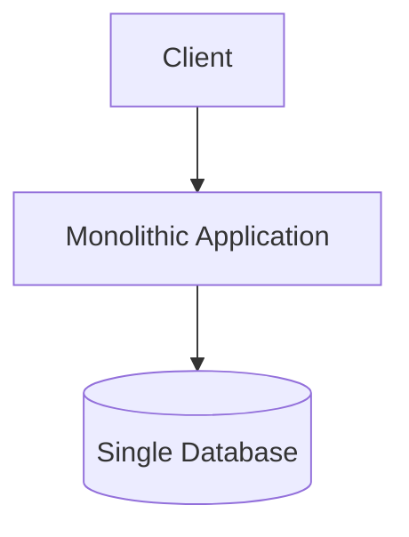

**Pros:** Simple to develop, test, and deploy; easy debugging (single stack trace); no network overhead between modules; straightforward transactions.
**Cons:** Scaling requires scaling the whole app even if only one part is under load; large codebase becomes harder to onboard into; a bug in one module can crash the entire app; slower deploys as the app grows.

### 2.2 Microservices Architecture

**Definition:** The application is split into small, independently deployable services, each owning its own data, communicating over the network (REST, gRPC, or async messaging).

**Real-world use case:** Netflix, Amazon — platforms with many teams that need to deploy independently and scale components (e.g., video transcoding vs. billing) very differently.

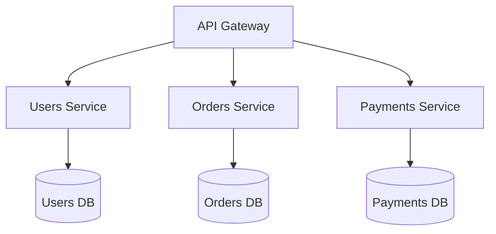

**Pros:** Independent scaling and deployment per service; teams can own services end-to-end; fault isolation (one service crashing doesn't necessarily take down others); polyglot tech stacks possible.
**Cons:** Operational complexity (many deployables, service discovery, distributed tracing); network latency and partial-failure handling; harder to maintain data consistency across services; requires mature CI/CD and observability practices.

### 2.3 Service-Oriented Architecture (SOA)

**Definition:** Predecessor to microservices — coarse-grained, reusable services typically integrated via an **Enterprise Service Bus (ESB)**, often using SOAP/XML, shared across many applications in an enterprise.

**Real-world use case:** Large enterprises (banks, telecoms) with many legacy systems that need a common integration layer.

**Pros:** Reuse across many consumer applications; centralized governance and integration logic; good fit for heterogeneous legacy landscapes.
**Cons:** The ESB can become a bottleneck and single point of failure; heavier protocols (SOAP) add overhead; centralized governance can slow delivery velocity compared to microservices' team autonomy.

### 2.4 Layered (N-Tier) Architecture

**Definition:** The system is organized into horizontal layers — typically presentation, business logic, and data access — where each layer only talks to the layer directly below it.

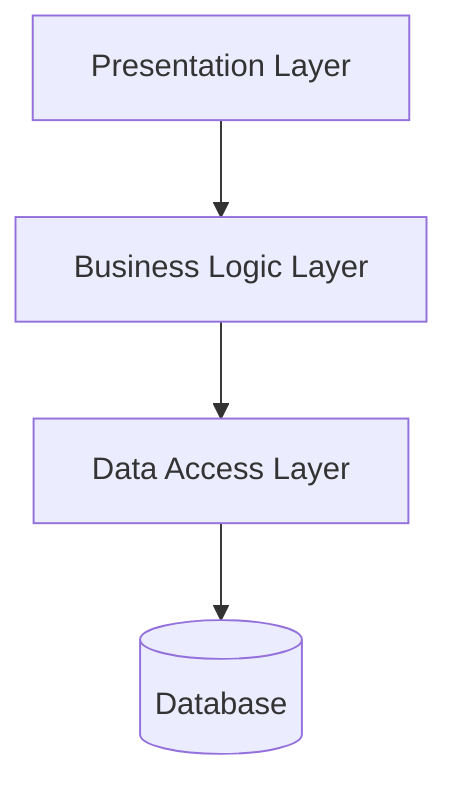

**Real-world use case:** Traditional enterprise web apps (e.g., an internal HR system built with Django's MVC-like structure).

**Pros:** Clear separation of concerns; familiar and easy to teach; layers can be tested independently.
**Cons:** Can become a "distributed monolith" if layers are deployed separately without real independence; changes sometimes ripple through every layer; risk of the business layer becoming a dumping ground ("fat middle layer").

### 2.5 Event-Driven Architecture (EDA)

**Definition:** Components communicate by producing and consuming events through a broker, rather than calling each other directly — enabling loose coupling and async workflows.

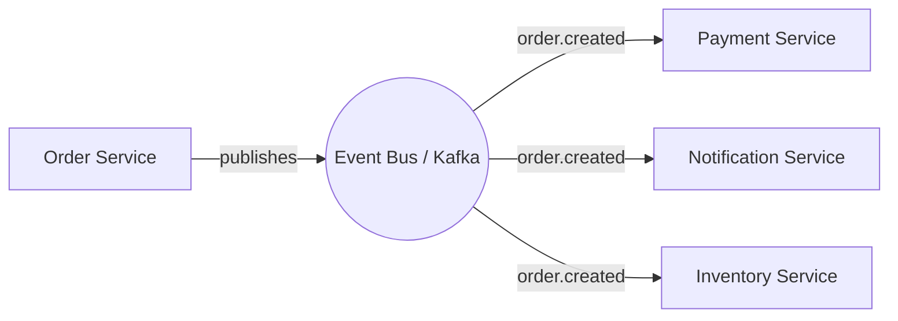

**Real-world use case:** Uber's trip lifecycle (ride requested → matched → started → completed), where many downstream systems react to the same event independently.

**Pros:** Strong decoupling between producers and consumers; natural fit for real-time/streaming use cases; new consumers can be added without touching producers.
**Cons:** Harder to trace a request's full path (needs distributed tracing); eventual consistency complicates reasoning about state; message ordering and duplicate delivery need careful handling.

### 2.6 Serverless Architecture

**Definition:** Application logic runs as ephemeral, event-triggered functions (or managed containers) with no server management — the cloud provider handles provisioning and scaling.

**Real-world use case:** Image-processing pipelines (S3 upload triggers a Lambda that generates thumbnails), lightweight APIs with spiky/unpredictable traffic.

**Pros:** No infrastructure management; automatic scaling including to zero; pay-per-execution pricing.
**Cons:** Cold starts add latency; execution time limits (e.g., 15 min on Lambda); vendor lock-in risk; harder to run stateful, long-lived, or WebSocket-heavy workloads; local development/debugging is less natural.

### 2.7 Client-Server Architecture

**Definition:** Clients request services/resources from a centralized server over a network — the foundational model underlying most web and mobile apps.

**Real-world use case:** Virtually every traditional web app — a browser (client) calling a REST API (server).

**Pros:** Simple mental model; centralized data and logic are easy to secure and update.
**Cons:** Server is a single point of failure/bottleneck unless explicitly scaled; client is fully dependent on server availability.

### 2.8 Peer-to-Peer (P2P) Architecture

**Definition:** Nodes act as both clients and servers, communicating directly with each other without a central coordinating server.

**Real-world use case:** BitTorrent file sharing, blockchain networks (Bitcoin, Ethereum).

**Pros:** No single point of failure; scales organically as more peers join; resilient to central server outages.
**Cons:** Harder to secure and govern; consistency and coordination are complex; discovery of peers needs its own mechanism; not a natural fit for typical business CRUD applications.

### 2.9 Hexagonal (Ports & Adapters) Architecture

**Definition:** The core business logic sits at the center, isolated from external concerns (databases, UI, third-party APIs) via defined "ports" (interfaces) and "adapters" (implementations) — making the core testable and swappable independent of infrastructure.

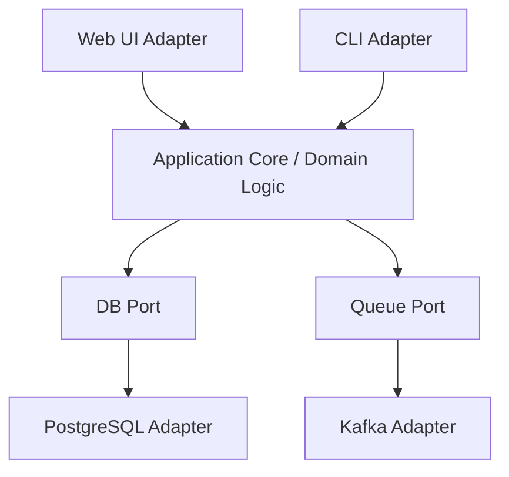

**Real-world use case:** Domain-heavy applications (e.g., a loan-underwriting engine) where business rules must remain stable and testable while the surrounding tech (database, message broker) may change over time.

**Pros:** Business logic is highly testable in isolation (mock the ports); infrastructure can be swapped with minimal core changes; encourages a clean domain model.
**Cons:** More upfront abstraction/boilerplate; can feel like over-engineering for simple CRUD apps; team needs discipline to keep the core free of infrastructure leakage.

### 2.10 CQRS & Event Sourcing

**Definition:** **CQRS** (Command Query Responsibility Segregation) splits the read model from the write model — commands mutate state, queries read from a separately optimized model. **Event Sourcing** stores state as an immutable sequence of events rather than the current snapshot; current state is derived by replaying events.

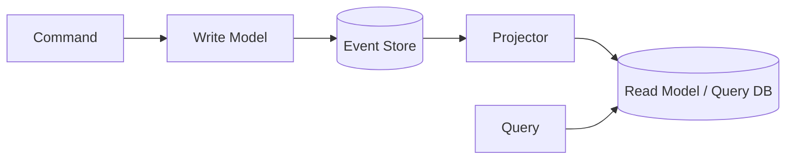

**Real-world use case:** Financial ledgers and trading systems, where a full audit trail of every state change is a hard requirement, and read/write load profiles differ drastically (e.g., banking transaction systems).

**Pros:** Full audit history "for free"; read and write sides can be scaled and optimized independently; enables temporal queries ("what was the balance on date X").
**Cons:** Significant complexity increase; eventual consistency between write and read models; replaying events for large histories can be slow without snapshotting; steep learning curve for teams new to the pattern.

### 2.11 Space-Based Architecture

**Definition:** Designed to eliminate the database as a central bottleneck by using **in-memory data grids** distributed across processing units ("spaces"), which replicate and synchronize data asynchronously — enabling extreme horizontal scalability for high-throughput workloads.

**Real-world use case:** High-volume e-commerce flash sales or ticket-booking systems (e.g., a concert ticketing platform during on-sale minute) that need to absorb massive, short-lived traffic spikes without the database collapsing.

**Pros:** Removes the central DB bottleneck under extreme load; near-linear horizontal scalability; low latency (in-memory processing).
**Cons:** Complex to implement and operate; eventual consistency with the persistent store; higher infrastructure cost (memory-heavy); overkill for most applications.

### 2.12 Comparison Table

| Architecture | Scalability | Complexity | Deployment | Fault Tolerance | Best-Fit Use Case |
|---|---|---|---|---|---|
| Monolithic | Low–Moderate (whole app scales together) | Low | Single unit, simple | Low (one failure can affect all) | Early-stage products, small teams |
| Microservices | High (per-service) | High | Many independent deployables | High (isolated failures) | Large-scale platforms, multi-team orgs |
| SOA | Moderate | High (ESB governance) | Centralized integration layer | Moderate (ESB can bottleneck) | Large enterprises with legacy systems |
| Layered (N-tier) | Low–Moderate | Low–Moderate | Often single unit | Low–Moderate | Traditional enterprise apps |
| Event-Driven | High | Moderate–High | Multiple services + broker | High (decoupled consumers) | Real-time systems, streaming workflows |
| Serverless | Very High (auto) | Low (infra) / Moderate (design) | Per-function, provider-managed | High (provider-managed retries) | Spiky traffic, event-triggered tasks |
| Client-Server | Low–Moderate (server-bound) | Low | Centralized server | Low unless server is scaled/HA | Traditional web/mobile apps |
| Peer-to-Peer | High (organic) | High | Distributed nodes | High (no single point of failure) | File sharing, blockchain |
| Hexagonal | Depends on adapters chosen | Moderate | Same as underlying deployment | Depends on adapters | Domain-heavy apps needing testability |
| CQRS & Event Sourcing | High (read/write scaled separately) | Very High | Multiple models + event store | High (event replay recovery) | Financial systems, audit-critical domains |
| Space-Based | Very High | Very High | Distributed in-memory grid | High (redundant processing units) | Extreme-spike workloads (flash sales) |

---

## 3. Importance of Good Architecture

### 3.1 Impact on Scalability, Performance, and Reliability

Architecture determines the system's **scaling ceiling**. A monolith with a single shared database can often be scaled vertically or with read replicas up to a point — beyond that, without re-architecting, it hits a wall. Good architecture builds in the seams (statelessness, service boundaries, async processing) that make scaling a configuration change rather than a rewrite.

### 3.2 Cost Implications

| Phase | Poor architecture | Good architecture |
|---|---|---|
| Development | Slower over time as coupling increases | Sustained velocity as the system grows |
| Hosting | Over-provisioned to compensate for bottlenecks | Right-sized, scales to actual demand |
| Maintenance | High — every change risks regressions elsewhere | Lower — changes are localized |

### 3.3 Effect on Team Productivity and Onboarding

Clear boundaries (service ownership, layered separation) let new engineers understand and contribute to one part of the system without needing to hold the entire codebase in their head. Poor architecture — tangled dependencies, unclear ownership — dramatically extends ramp-up time and increases the "fear factor" of making changes.

### 3.4 Risk Mitigation

- **Technical debt** compounds silently in poorly bounded systems — a change in one place breaks three unrelated features.
- **Security** — a well-architected system has clear trust boundaries (e.g., a DMZ/API gateway layer) rather than every component trusting every other component implicitly.
- **Downtime** — fault isolation (bulkheads, circuit breakers, service boundaries) contains failures instead of letting them cascade into total outages.

### 3.5 Business Agility

Good architecture is a direct enabler of business speed: independently deployable services let teams ship features without waiting on a full-system release train, and clean boundaries make it far easier to pivot a specific part of the product without rewriting everything around it.

---

## 4. Key Architectural Principles

### 4.1 Separation of Concerns (SoC)

Each part of the system should address a distinct concern (e.g., authentication vs. business rules vs. persistence) so that a change to one doesn't ripple through unrelated logic. In practice: keep HTTP-handling code out of your business logic, and keep SQL out of your domain models.

### 4.2 Single Responsibility Principle (System Level)

At the system level, SRP means **each service/module should have one reason to change**. If your `users` service also handles billing logic, a billing requirement change now risks breaking user management — a sign the boundary is wrong.

### 4.3 Loose Coupling & High Cohesion

- **Loose coupling**: components depend on each other as little as possible — ideally through well-defined interfaces/contracts (an API schema, an event schema) rather than shared internals.
- **High cohesion**: related functionality lives together — a `payments` service should contain everything about processing payments, not scatter it across three services.

### 4.4 Design for Failure

Assume every network call, dependency, and server can and will fail. Build in:
- Timeouts and retries with backoff
- Circuit breakers to stop hammering a failing dependency
- Graceful degradation (serve cached/stale data rather than a hard error)
- Redundancy (multiple AZs/replicas, no single point of failure)

> **Tip:** "Design for failure" is the mental shift from "how do I prevent this from failing" (impossible to guarantee) to "how does the system behave gracefully when it does fail" (achievable and testable).

### 4.5 Twelve-Factor App Methodology

A set of practices for building portable, scalable, cloud-native applications:

| Factor | Practice |
|---|---|
| 1. Codebase | One codebase tracked in version control, many deploys |
| 2. Dependencies | Explicitly declare and isolate dependencies (`requirements.txt`, lockfiles) |
| 3. Config | Store config in environment variables, not in code |
| 4. Backing services | Treat databases/queues as attached resources, swappable via config |
| 5. Build, release, run | Strictly separate build and run stages |
| 6. Processes | Run the app as stateless processes; persist state externally |
| 7. Port binding | Export services via port binding, not relying on a runtime-injected web server |
| 8. Concurrency | Scale out via the process model (more processes/instances) |
| 9. Disposability | Fast startup and graceful shutdown for robustness |
| 10. Dev/prod parity | Keep environments as similar as possible |
| 11. Logs | Treat logs as event streams, write to stdout, let the platform aggregate |
| 12. Admin processes | Run admin/management tasks as one-off processes in the same environment |

---

## 5. How to Maintain Architecture

### 5.1 Documentation Practices

**Architecture Decision Records (ADRs)** — short, versioned documents capturing a single architectural decision, its context, and its consequences:

```markdown
# ADR-012: Use PostgreSQL as the primary datastore for Orders Service

## Status
Accepted

## Context
Orders Service needs strong transactional guarantees for order state
transitions and needs to support complex relational queries for reporting.

## Decision
Use PostgreSQL (managed via RDS/Cloud SQL) as the primary datastore.

## Consequences
+ Strong ACID guarantees for order transitions
+ Mature tooling and team familiarity
- Vertical scaling limits beyond a certain write throughput
- Will require read replicas or CQRS if reporting load grows significantly
```

Combine ADRs with living **diagrams** (see Section 7.1 — the C4 model is a strong default) so decisions and structure stay discoverable, not locked in one person's head.

### 5.2 Code Reviews and Architectural Governance

- Add an "architecture" checklist item to PR templates for changes that cross service boundaries or touch shared contracts (APIs, event schemas, database schemas).
- Establish an **architecture review board** or a lightweight "RFC" process for decisions with wide blast radius — not for every PR, but for anything that would need an ADR.
- Use **fitness functions** (automated architectural tests, e.g., dependency-direction checks with tools like `ArchUnit` or `import-linter`) to catch architectural drift in CI rather than relying purely on manual review.

### 5.3 Monitoring Architectural Drift Over Time

Architecture drifts when implementation diverges from the intended design (e.g., a "microservice" starts reaching directly into another service's database for convenience). Combat this with:
- Periodic architecture audits against the ADRs/diagrams
- Dependency-graph analysis tools to visualize actual vs. intended coupling
- Service ownership boundaries enforced at the infrastructure level (network policies, IAM) — not just by convention

### 5.4 Refactoring Strategies Without Breaking Production

- **Strangler Fig pattern**: route a small slice of traffic to the new implementation while the old one still serves the rest, gradually increasing the slice until the old code can be removed.
- **Feature flags**: ship new architecture behind a flag, enable for internal users/a percentage of traffic first.
- **Parallel run / shadow traffic**: send real traffic to both old and new implementations, compare outputs, without the new path affecting users yet.
- Always maintain backward compatibility during the transition window (see versioning below).

### 5.5 Versioning Strategies (APIs, Services, Databases)

| Layer | Strategy |
|---|---|
| **APIs** | URI versioning (`/v1/orders`) or header-based versioning; never break existing consumers without a deprecation window |
| **Services** | Deploy new versions alongside old during migration (blue-green, canary); use consumer-driven contract tests (e.g., Pact) to catch breaking changes before release |
| **Databases** | Expand/contract pattern — add new columns/tables without removing old ones, migrate data, update code to use new schema, only then drop the old schema in a later release |

### 5.6 Technical Debt Management

- Track debt explicitly (a tagged backlog, not just tribal knowledge) with an estimated cost of delay.
- Allocate a fixed percentage of each sprint/cycle (many teams use ~15–20%) to debt paydown rather than treating it as "extra" work that never gets scheduled.
- Distinguish **deliberate debt** (a conscious shortcut with a plan to revisit) from **accidental debt** (drift/decay) — the former is a legitimate trade-off, the latter needs process fixes.

### 5.7 Regular Architecture Review Cycles

Hold periodic (e.g., quarterly) architecture reviews to:
- Re-validate that current NFRs (scale, latency, compliance) are still being met
- Review recent ADRs and drift audits
- Revisit "temporary" decisions made under deadline pressure
- Update diagrams/documentation to match reality

---

## 6. How to Scale Architecture

### 6.1 Vertical Scaling vs. Horizontal Scaling

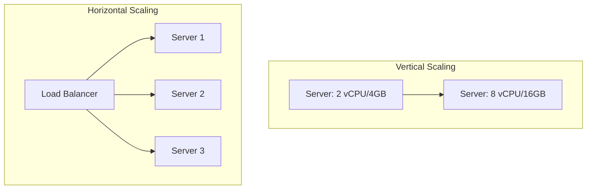

| | Vertical Scaling | Horizontal Scaling |
|---|---|---|
| **Approach** | Bigger machine (more CPU/RAM) | More machines running in parallel |
| **Ceiling** | Hard limit (largest instance size available) | Effectively unlimited |
| **Downtime** | Often requires a restart/resize | Can add capacity with zero downtime |
| **Complexity** | Low | Higher — needs load balancing, statelessness |
| **Cost curve** | Non-linear at the high end (large instances get disproportionately expensive) | More linear, and elastic (pay for what you use) |

### 6.2 Load Balancing Strategies

| Strategy | How it works | Good for |
|---|---|---|
| Round robin | Requests distributed sequentially across servers | Uniform, stateless workloads |
| Least connections | Routes to the server with fewest active connections | Uneven request durations |
| IP hash / consistent hashing | Same client routed to the same server | Session affinity without shared session store |
| Weighted | Servers get traffic proportional to assigned weight | Mixed instance sizes, canary rollouts |
| Layer 7 (application-aware) | Routes based on URL path/headers | API gateways, microservice routing |

### 6.3 Database Scaling

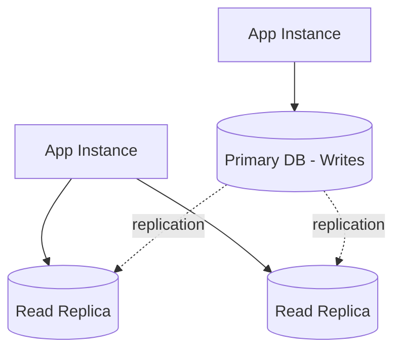

- **Replication (read replicas):** Route reads to replicas, writes to the primary — effective when read traffic dominates write traffic (common in most web apps).
- **Sharding:** Split data horizontally across multiple database instances by a shard key (e.g., `user_id % N` or geography) — needed when a single instance can't hold or serve the full write volume.
- **Caching layers (Redis/Memcached):** Cache frequently-read, rarely-changed data in memory to offload the database entirely for hot paths (session data, product catalogs, computed aggregates).

> **Warning:** Sharding adds significant complexity (cross-shard queries, rebalancing) — exhaust replication, caching, and query optimization first before reaching for it.

### 6.4 Statelessness for Horizontal Scaling

Application servers should not hold session/user state in local memory or disk — any request should be servable by any instance. Move state to:
- A shared cache (Redis) for session data
- The database for persistent state
- Signed tokens (JWTs) to push session state to the client itself

This is what makes horizontal scaling and auto-scaling actually work — new instances can join the pool with zero warm-up of local state.

### 6.5 Auto-Scaling (Cloud-Native)

| Provider | Mechanism |
|---|---|
| AWS | Auto Scaling Groups (EC2), ECS Service Auto Scaling, Application Auto Scaling |
| Azure | VM Scale Sets, App Service autoscale rules, Container Apps KEDA-based scaling |
| GCP | Managed Instance Groups, Cloud Run concurrency-based autoscaling |

Common triggers: CPU/memory utilization, request queue depth, custom application metrics (e.g., queue backlog size).

### 6.6 Message Queues & Asynchronous Processing

Decouple slow or bursty work from the request/response cycle:

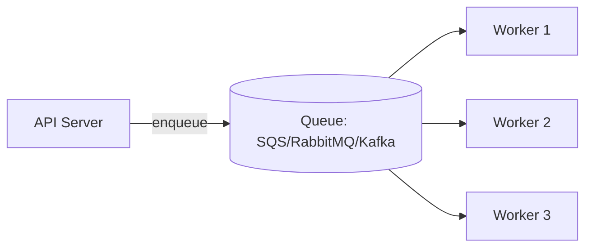

| Tool | Model | Best for |
|---|---|---|
| **Kafka** | Distributed log, high-throughput streaming, multiple consumer groups | Event sourcing, analytics pipelines, high-volume event streams |
| **RabbitMQ** | Traditional message broker (queues, exchanges, routing) | Task queues, request/reply patterns, complex routing |
| **AWS SQS** | Managed, simple queue (standard/FIFO) | Decoupling AWS-native workloads with minimal ops |

### 6.7 CDN and Edge Caching for Global Scale

Serve static assets (and increasingly, cacheable API responses) from edge locations close to users — reduces latency and offloads origin servers. Use cache-control headers deliberately, and invalidate/purge on deploy for versioned assets.

### 6.8 Breaking a Monolith into Microservices (Migration Strategy)

1. **Identify seams** using domain boundaries (Domain-Driven Design's "bounded contexts") — not arbitrary technical splits.
2. **Extract the least-coupled module first** (e.g., notifications) to prove the pattern with low risk.
3. Apply the **Strangler Fig pattern**: route traffic for the extracted capability to the new service via the gateway/router while the monolith still serves everything else.
4. Give the new service its **own database**, migrating data with a defined cutover plan (dual-write or CDC-based sync during transition).
5. Repeat, extracting services in order of business value and coupling risk, re-evaluating after each step — this is a multi-quarter/year process for a real system, not a single migration event.

### 6.9 Circuit Breakers, Rate Limiting, and Graceful Degradation

- **Circuit breaker**: after N consecutive failures calling a dependency, "open" the circuit and fail fast (or serve a fallback) for a cooldown period, instead of continuing to hammer a struggling service.
- **Rate limiting**: protect services from being overwhelmed by a single caller (token bucket/leaky bucket algorithms), applied at the API gateway or per-service.
- **Graceful degradation**: when a non-critical dependency fails, serve a reduced experience (e.g., show cached recommendations instead of a personalized feed) rather than failing the entire request.

---

## 7. Tools & Frameworks

### 7.1 Architecture Diagramming Tools

| Tool | Strength |
|---|---|
| **draw.io / diagrams.net** | Free, flexible, widely used for any diagram type |
| **Lucidchart** | Polished collaborative diagramming, good for cross-team docs |
| **C4 Model** (with Structurizr or PlantUML/Mermaid) | A structured approach with 4 levels — Context, Container, Component, Code — giving each audience (executives vs. engineers) the right level of detail |

**C4 model levels:**
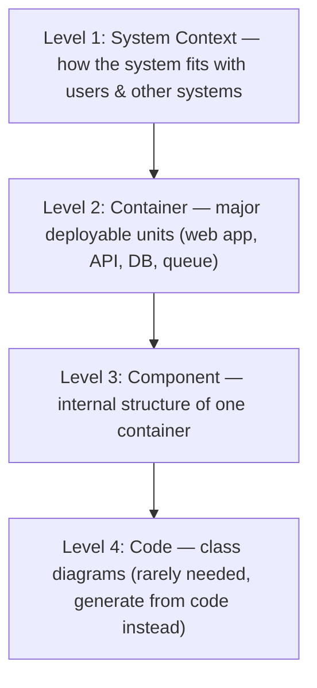

### 7.2 Monitoring/Observability Tools

| Tool | Category | Use |
|---|---|---|
| **Prometheus** | Metrics collection | Pull-based time-series metrics, integrates with Kubernetes natively |
| **Grafana** | Visualization | Dashboards over Prometheus (or other) data sources |
| **Datadog** | Full-stack observability (SaaS) | Metrics, logs, traces, APM in one managed platform |
| **OpenTelemetry** | Instrumentation standard | Vendor-neutral tracing/metrics instrumentation, exportable to any backend |

### 7.3 Infrastructure as Code

| Tool | Scope |
|---|---|
| **Terraform** | Multi-cloud, declarative, the most widely adopted IaC tool |
| **AWS CloudFormation** | AWS-native declarative IaC, deeply integrated with AWS services |
| **Pulumi** | IaC using general-purpose languages (Python, TypeScript) instead of a DSL |
| **Azure Bicep / ARM templates** | Azure-native IaC |

---

## 8. Case Study: E-Commerce App, Monolith → Microservices

### Stage 1 — MVP: Monolith

A small team builds the first version: a single Django app handling users, product catalog, cart, orders, and payments, backed by one PostgreSQL database.

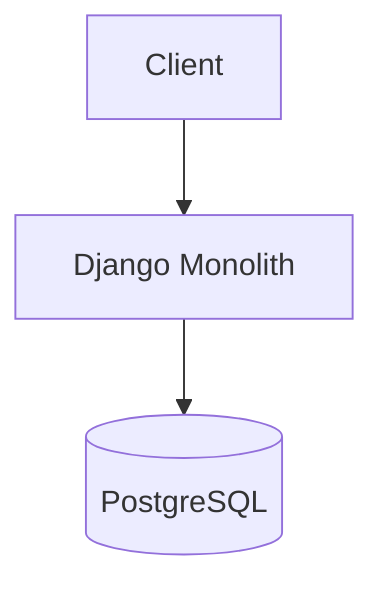

**Why this is the right call:** The team is small, requirements are still shifting weekly, and a monolith lets them iterate fast without the overhead of distributed systems. Premature microservices here would slow them down for no real benefit.

### Stage 2 — Growth: Extracting the First Bottleneck

Traffic grows. The **product search/catalog** feature becomes the clear bottleneck — read-heavy, needs full-text search, and is scaled very differently from the order-processing path. The team extracts it into its own service backed by Elasticsearch, while everything else stays in the monolith.

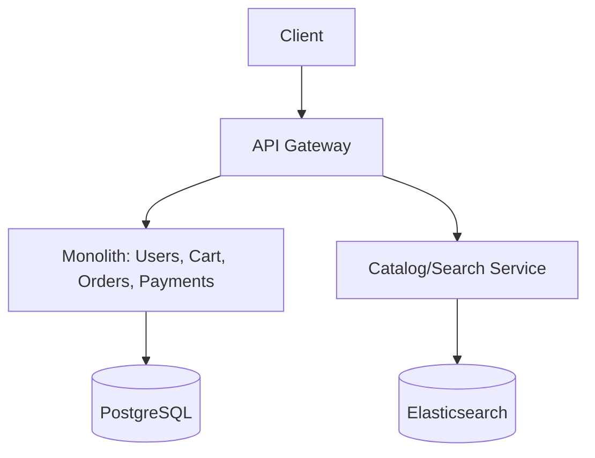

**Decision rationale (would be captured in an ADR):** Search has a fundamentally different data access pattern and scaling profile than the transactional core — a natural, low-risk first seam to extract using the Strangler Fig pattern.

### Stage 3 — Scale: Event-Driven Order Processing

Order volume spikes during sales events. The team introduces a message broker (Kafka) so that placing an order publishes an `order.created` event, consumed asynchronously by payments, inventory, and notifications — decoupling the checkout request from slower downstream processing.

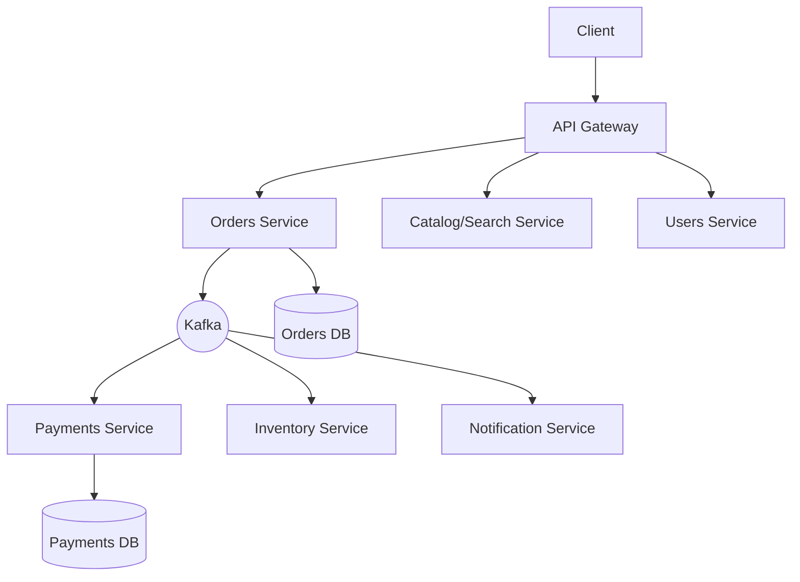

**Why now, not earlier:** The pain (checkout latency during traffic spikes, tight coupling between order placement and notification sending) is now real and measured — not hypothetical. This justifies the added complexity of async messaging.

### Stage 4 — Maturity: Full Microservices with Observability & Resilience

Remaining monolith pieces (users, cart) are extracted following the same pattern. Each service gets its own database, CI/CD pipeline, and Kubernetes deployment with HPA. Circuit breakers wrap all cross-service calls; distributed tracing (OpenTelemetry + Jaeger) is added so a single checkout request can be traced across all six services; rate limiting is enforced at the gateway.

**Key lesson from the case study:** the migration happened **incrementally, driven by measured pain points**, not as a big-bang rewrite — each stage's added complexity was justified by a concrete, current problem, exactly as recommended in Section 6.8.

---

## 9. Common Pitfalls

### 9.1 Over-Engineering vs. Under-Engineering

| Over-engineering | Under-engineering |
|---|---|
| Building for 10M users when you have 100 | Never revisiting architecture as the system and team grow |
| Microservices for a 3-person team's MVP | A 200-engineer org still shipping one giant monolith with no ownership boundaries |
| Adding CQRS/Event Sourcing to a simple CRUD app | No caching, no read replicas, database falling over under normal growth |
| **Cost:** wasted time, slower initial delivery, unnecessary operational burden | **Cost:** technical debt, scaling walls, painful eventual rewrites |

> **Tip:** Architect for the scale you'll realistically hit in the next 12–18 months, with a clear path (not necessarily the implementation) for the scale after that. Don't build for hypothetical scale you may never reach.

### 9.2 Premature Microservices Adoption

Splitting into microservices before you have: (a) a real scaling or team-boundary problem, and (b) the operational maturity (CI/CD, observability, on-call practices) to run distributed systems — typically produces a "distributed monolith": all the coupling problems of a monolith, plus all the operational overhead of microservices, with none of the benefits of either.

### 9.3 Ignoring Non-Functional Requirements (Security, Observability)

Non-functional requirements are easy to skip because they don't show up as a checkbox on a feature list — but they define whether the system is trustworthy and operable:
- **Security** bolted on late usually means retrofitting auth/authorization boundaries across services that were never designed with trust boundaries in mind.
- **Observability** skipped early means the first major production incident happens with no logs, metrics, or traces to diagnose it — exactly when you need them most.

Both should be first-class requirements from the first ADR, not an afterthought once "the real features" are done.
